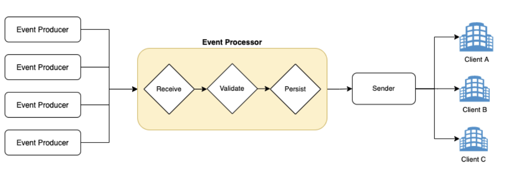
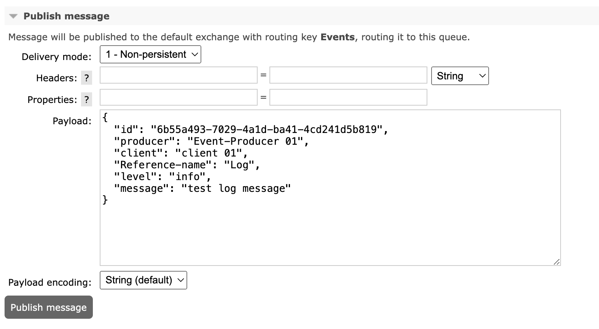
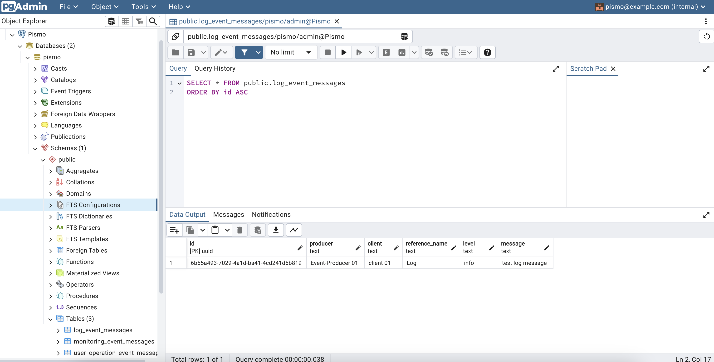

# DesafioPismo

# Introdução

Projeto se solução proposta para o desafio Pismo de event-processor. O sistema proposto se conecta a uma fila de eventos
em uma instância RabbitMQ, e baseado no tipo de evento recebido é realizada a persistência do mesmo em uma tabela de
dados correspondente em um banco de dados Postgres.

# Arquitetura da solução

Toda a aplicação roda baseada em uma stack de serviços utilizando o Docker. Ao iniciar a aplicação, o código será
compilado e estará disponível dentro da stack. Ele se conectará aos serviços de mensageria e bancos de dados e estará
pronto
para receber eventos. A solução resolve implementa o event-processor proposto na arquitetura abaixo:



## Solucão proposta

O sistema está preparado para realizar a triagem de eventos e realizar a persistência dos mesmos em banco de dados,
para posterior consumo por outro serviço.

O formato básico de um envento do sistema deve conter esses campos:

`{
"id": "6b55a493-7029-4a1d-ba41-4cd241d5b819",
"producer": "Event-Producer 01",
"client": "client 01",
"Reference-name": "Log",
}
`
A depender do valor encontrado na chave `Reference-name`, o sistema vai reconhecer a tratar os seguintes eventos:

- Evento de log: o `reference-name` deve conter o valor `log`, e o evento adiciona as chaves de `level` e `message` ao
  cabeçalho default, conforme abaixo:
  `{
  "id": "6b55a493-7029-4a1d-ba41-4cd241d5b819",
  "producer": "Event-Producer 01",
  "client": "client 01",
  "Reference-name": "Log",
  "level": "info",
  "message": "test log message"
  }`

---

- Evento de monitoramento: o `reference-name` deve conter o valor `Monitoring`, e o evento adiciona as chaves de
  `object-id`, `traceId` e `message` ao cabeçalho default, conforme abaixo:
  `{
  "id": "6b55a493-7029-4a1d-ba43-4cd241d5b819",
  "producer": "Event-Producer 01",
  "client": "client 01",
  "Reference-name": "Monitoring",
  "object-id": "123456",
  "traceId": "123123",
  "message": "Monitoring message 1"
}`

---

- Evento de ação do usuário: o `reference-name` deve conter o valor `User`, e o evento adiciona as chaves de `user-id` e
  `operation` ao cabeçalho default, conforme abaixo:
  `{
  "id": "6b55a493-7029-4a1d-ba45-4cd241d5b819",
  "producer": "Event-Producer 01",
  "client": "client 01",
  "Reference-name": "User",
  "user-id": "123234",
  "operation": "user profile update"
}`

---
Mensagens que não seguirem esse padrão serão transferidas para a fila Events-Error a medida em que forem consumidas

## Executando a aplicação

Inicie o serviço e as intâncias do postgresql (banco de dados), rabbitmq (mensageria) e o pgadmin (plataforma de
administração do PostgreSQL)

```
docker-compose up -d
```

### Interagindo com a solução

O sistema de mensageria pode ser acessado [AQUI](http://localhost:15672/#/queues), o usuário para acesso de teste é
_`dummyUser`_ e o password é _`dummyPass`_. Após acessar é possível verificar o consumo e envio de mensagens para a
aplicação.

#### Enviando uma mensagem de teste manualmente

É possível forçar o envio de mensagens para validar o funcionamento da aplicação. Existem eventos de exemplo na
pasta /tests/mockEvents desse projeto. Ao copiar o conteúdo dos eventos, basta colar o mesmo como payload da mensagem e
clicar no botão de envio, conforme abaixo:



#### Verificando o conteúdo do banco de dados

Para acessar o banco de dados da aplicação, a ferramenta PGAdmin está inserida na stack de testes.
Seu acesso pode ser realizado [AQUI](http://localhost:15432/browser/). O usuário de acesso é _`pismo@example.com`_
e a senha é _`123456`_. Somente no primeiro acesso, será necessário configurar a conexão com o banco de dados,
caso não esteja familiarizado sobre o uso da aplicação consulte
a [documentação](https://www.pgadmin.org/docs/pgadmin4/development/connecting.html) da mesma.
As informações de acesso ao banco de dados da aaplicação são as seguintes:

`Database: pismo
USER: admin
PASSWORD: 123456
`

Ao se conectar, deverá ser possível visualizar o sistema:



# Test

# Contribute

TODO: Explain how other users and developers can contribute to make your code better.

